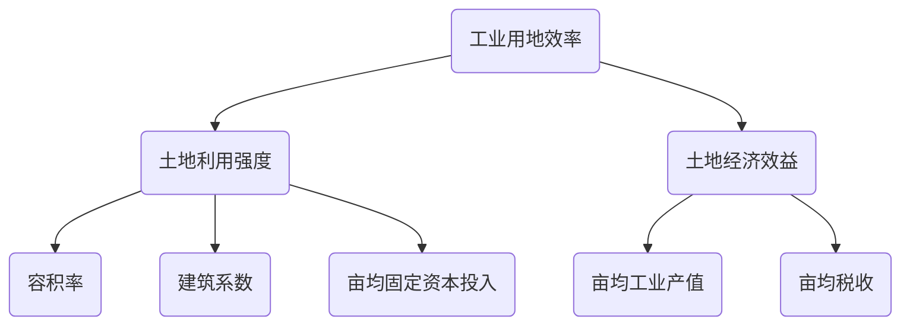
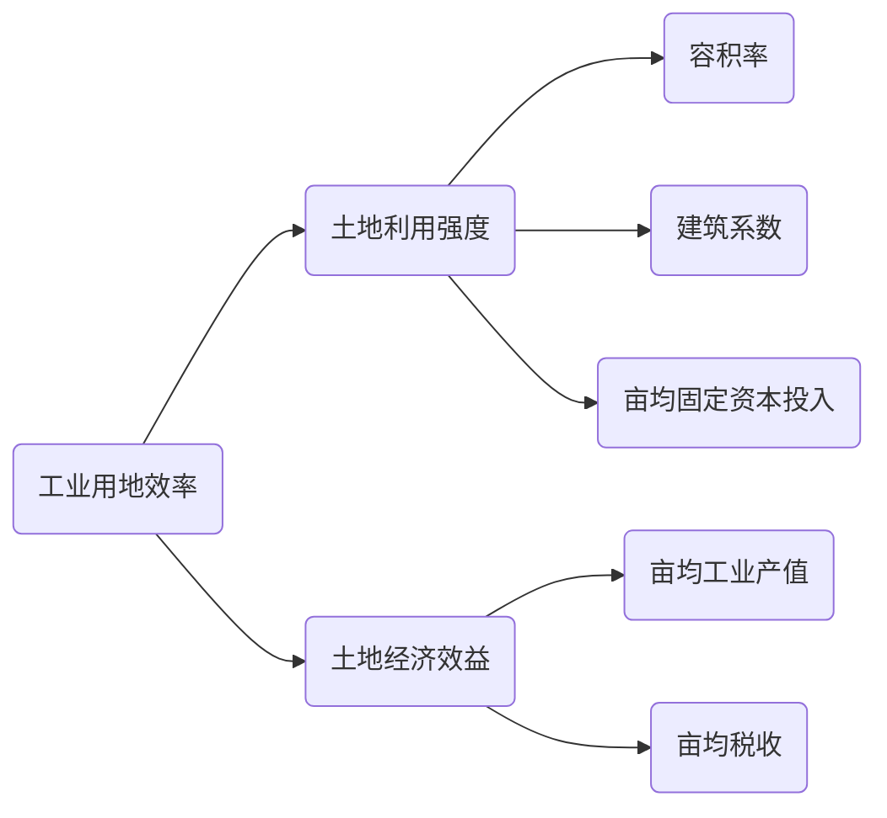
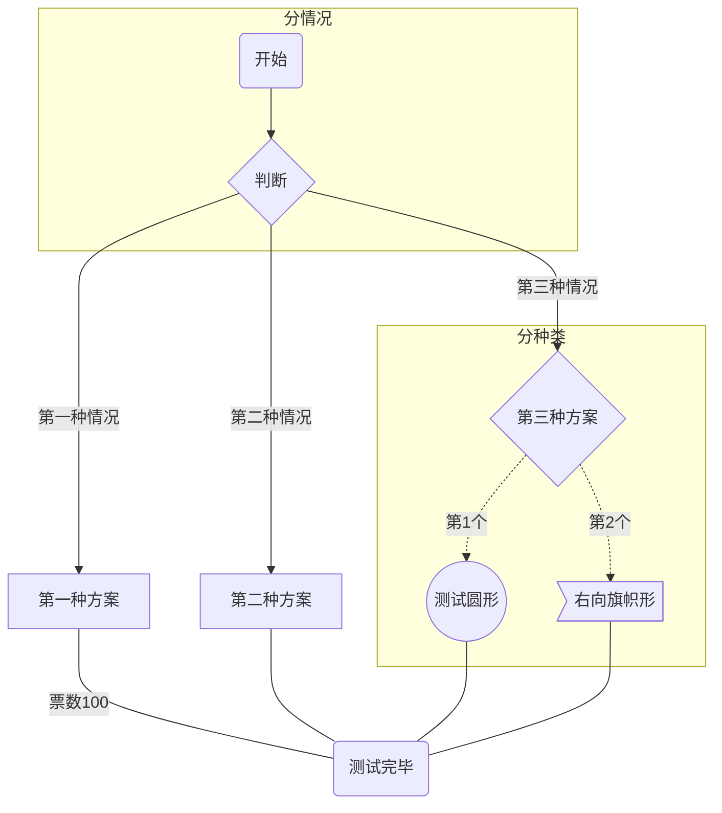
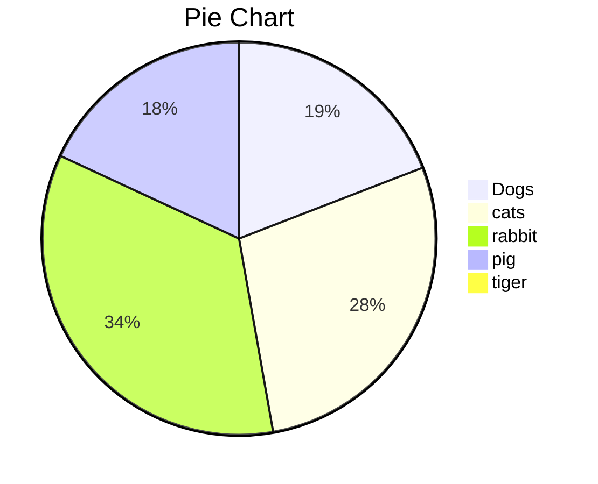
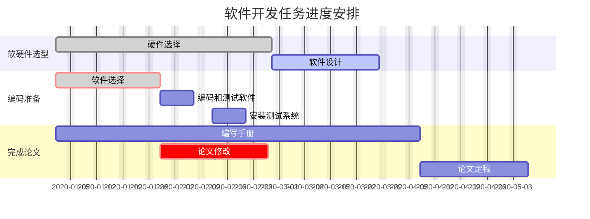
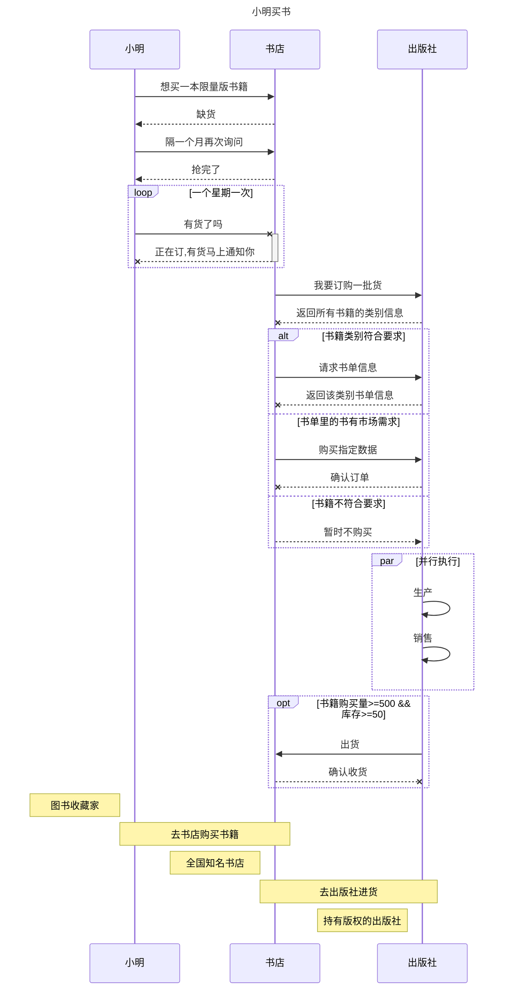

## 海外谷歌/苹果上架及推广具体情况表


### 一、谷歌/苹果上架
> 谷歌上架--6000RMB
> 苹果上架--8000RMB
 ``` 
说明：由于是要上架App Store，而且是色情类的APP，所以需要咱们自己做个马甲包，这个马甲包他们负责上架，马甲包上架后强制更新成咱们的色情APP；如果别人举报导致被封或下架，会帮代为再次上架，不过会另外收费，这个收费标准视对上架账号造成的风险而定，大概范围是2000-5000RNM
 ```


### 二、推广
> 当地网红
> > 按照粉丝数和粉丝活跃度来收费，收费标准需要等明天发给我们
> 
> 支持担保
> > 说是由担保方收取担保费，按照业务的4%收取；如果信得过他们，也可以直接交易，不用担保
> 

 ``` 
说明：他们只做海外业务，没做国内的业务
 ```
















```flow
start=>start: 开始
input=>inputoutput: 输入
operation=>operation: 操作
condition=>condition: 操作出错？
output=>inputoutput: 输出
error=>operation: 请重新输入
end=>end: 结束

start->input
input->operation
operation->condition
condition(no,bottom)->output
condition(yes)->error(top)->input
output->end
```
